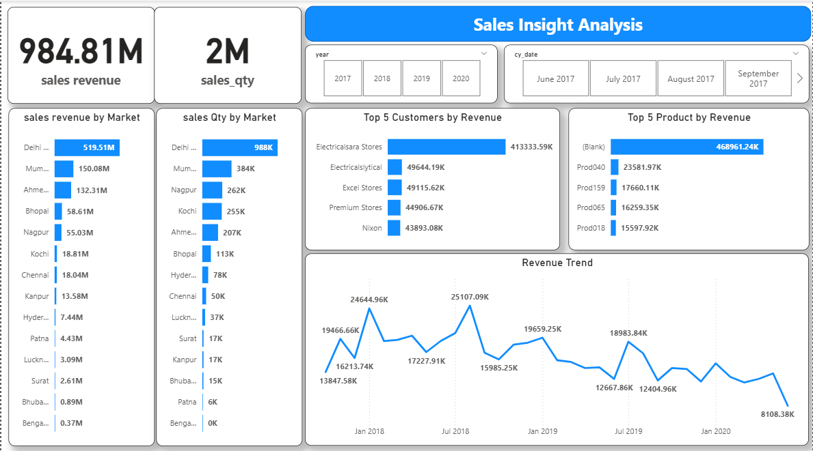

# Sales Insight Analysis with Power BI and MySQL

## Project Overview
This project demonstrates a complete end-to-end business intelligence workflow by integrating MySQL with Power BI to create an interactive sales insight dashboard. The goal is to enable stakeholders to monitor revenue trends, identify top-performing markets, customers, and products, and make data-driven decisions efficiently. 

By connecting directly to a local MySQL database, I ensured real-time data refresh capabilities and avoided manual exports, which is a common limitation in static reporting.

---

## Tools and Technologies
- **Database:** MySQL (local server)
- **BI Tool:** Microsoft Power BI
- **Data Connectivity:** Native MySQL Database Connector
- **Data Processing:** Power Query (for cleaning, trimming, and transforming data)
- **Visualization:** Power BI (cards, bar charts, line chart, slicers)

---

## Data Preparation
1. **Data Source Integration**  
   - Established a live connection from Power BI to MySQL using the native connector.
   - Queried transactional-level sales data including revenue, quantity, order dates, markets, customers, and products.

2. **Data Cleaning and Transformation**  
   - Standardized inconsistent currency labels (e.g., `"USD"` vs `"USD#(cr)"`).
   - Applied trimming and cleaning functions in Power Query to remove unwanted characters and spaces.
   - Filtered duplicates based on multiple columns (sales amount, currency, order date, and sales quantity).
   - Ensured proper data types (e.g., date fields as Date, quantities as Whole Numbers).

3. **Data Modeling**  
   - Created relationships between fact and dimension tables (Markets, Products, Customers).
   - Implemented time intelligence measures for year, month, and custom date slicers.

---

## Example SQL Queries
To ensure only relevant and clean data was sent to Power BI, I prepared some of the data directly in MySQL.  
Below are examples of queries I used:

---

## Dashboard Features
The final dashboard provides a comprehensive view of sales performance across different business dimensions.

### Key Metrics
- **Total Sales Revenue:** 984.81M  
- **Total Sales Quantity:** 2M  

### Visual Insights
- **Sales Revenue by Market:** Identifies top contributing regions such as Delhi, Mumbai, and Ahmedabad.  
- **Sales Quantity by Market:** Highlights markets with the highest sales volume.  
- **Top 5 Customers by Revenue:** Displays most profitable clients (e.g., Electricalsara Stores, Electricalslytical).  
- **Top 5 Products by Revenue:** Ranks products based on contribution, including handling of blank categories.  
- **Revenue Trend:** Shows historical revenue performance across multiple years, enabling trend analysis.  

### Interactive Filters
- **Year Selector:** 2017–2020 for year-over-year comparisons.  
- **Custom Date Range Slicer:** Enables analysis across months within a specific year.  

---

## Dashboard Preview

---

## Insights & Business Impact
1. Revenue concentration is heavily skewed towards specific markets (Delhi alone contributes over 50% of total sales).  
2. A single customer, *Electricalsara Stores*, drives a disproportionately high share of revenue.  
3. Revenue shows cyclical fluctuations, with noticeable peaks around mid-year and declines towards the end of 2019–2020.  
4. Some products dominate revenue generation, but there are gaps in data quality (e.g., blank product categories), indicating areas for data governance improvements.  

---

## Key Learnings
- Live database connections via Power BI can streamline reporting and remove reliance on manual CSV/Excel exports.  
- Data cleaning and transformation in Power Query are crucial to unify inconsistent entries and maintain reporting accuracy.  
- Even with strong visuals, understanding underlying data anomalies (like duplicate currencies or blank products) is critical to ensure reliable insights.  

---

## Next Steps
- Implement row-level security (RLS) in Power BI to restrict sensitive market or customer data by user roles.  
- Automate daily refresh schedules for real-time analytics.  
- Enhance product categorization to eliminate blanks and improve product-level insights.  

---

## Conclusion
This project highlights my ability to connect relational databases with modern BI tools, perform advanced data cleaning and modeling, and deliver executive-level dashboards that provide actionable business insights.  

It showcases technical proficiency in SQL, Power Query, and Power BI while demonstrating a strong grasp of storytelling through data visualization.

---
